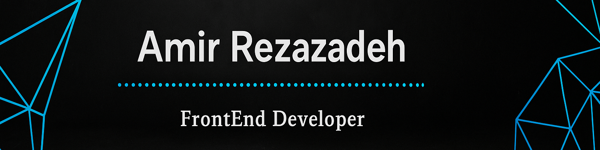

  
  

# 
🖥️ Amir Rezazadeh | Front-End Developer
  
  
  

### *
Hi! I'm Amir Rezazadeh, a passionate Front-End Developer who loves building clean, responsive, and user-friendly web applications.
*  
  

### 🚀 About Me  
- 🌱 I started learning **HTML**, **CSS**, and **JavaScript** about 2 years ago.   
  

- 💡 Interested in **UI/UX Design**, **animations**, and **responsive web development**.  
  

- ⚛️ Currently learning **React** and modern front-end tools.  
  

- 🤝 Looking for opportunities to grow, collaborate, and contribute to real-world projects. 

-  📄 [Download My Resume (PDF)](https://github.com/amirRezazade/amirRezazade/raw/main/Amir-Rezazade-resume.pdf)

  

   

## My Skill

  
  
  
  
 
  
  
  
  

  

   

## Connect with me  

  
  

  
   

  

